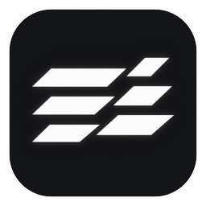
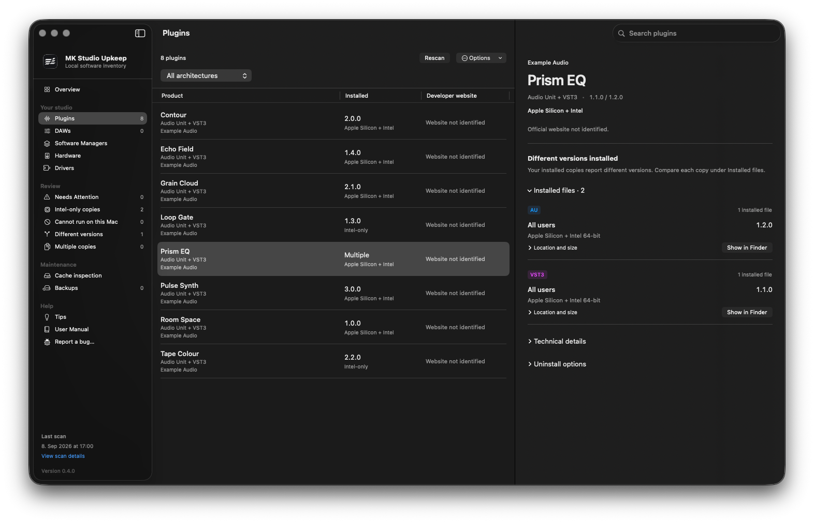
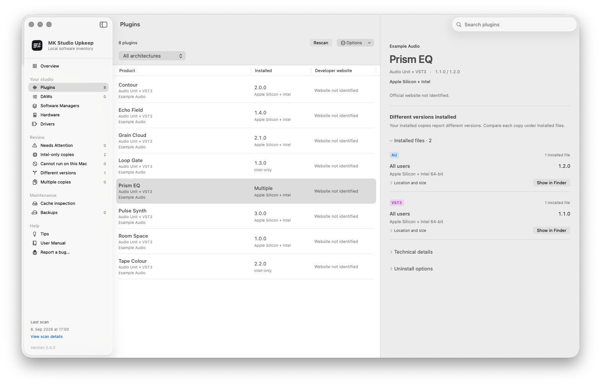
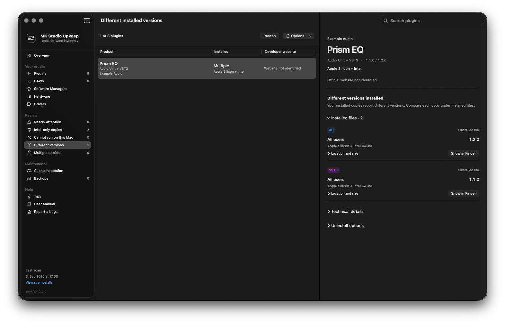
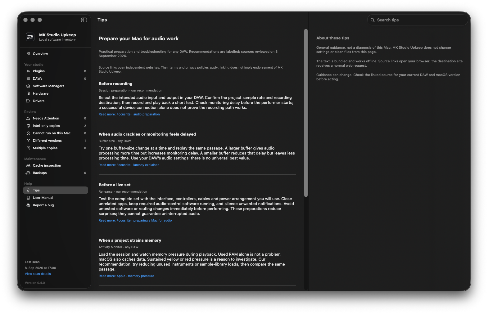

<div align="center">
  
  <h1>MK Studio Upkeep</h1>
  <p><strong>Your studio software, in one place.</strong></p>
  <p>A free, open-source macOS app for music producers and studio engineers.</p>
  <p>
    <a href="https://github.com/mks-devx/MK-Studio-Upkeep/releases">Download</a> ·
    <a href="docs/USER_MANUAL.md">User manual</a> ·
    <a href="#report-a-bug">Report a bug</a>
  </p>
</div>

Browse your installed plugins and DAWs, spot Intel-only copies and different
installed versions, and find official websites where you can check for updates.
Open supported software managers and review your audio devices and drivers from
the same app.

Released under the [GNU Affero General Public License v3.0](LICENSE).

**Scanning stays on your Mac.** No account, telemetry or inventory upload is required.

## What it does

Version 0.4.1 improves recovery from damaged backup records and refreshes software-manager discovery. Verified local recovery copies protect eligible in-app removals. Review
continues to show locally detected facts without newer-edition suggestions.

- **Inventory plugins:** scan Audio Unit, VST3, VST2 and CLAP plugins in standard
  and additional folders. Group matching formats and inspect each installed file and version.
- **Review local findings:** find Intel-only copies, files whose architecture cannot
  run on this Mac, different installed versions and repeated formats.
- **Find update destinations:** open reviewed developer websites and installed
  software managers. Latest plugin and DAW releases are not fetched or compared.
- **Inspect the studio:** browse recognised DAWs, software managers, audio/MIDI
  devices and installed audio drivers in separate views.
- **Review maintenance:** inspect recognised caches, read audio preparation tips,
  review eligible software bundles before an optional move to Trash, and restore
  verified local backups when needed.

The plugin scanner works without a developer-directory entry. Website coverage,
DAW recognition and manager recognition are limited. Missing metadata stays
unknown. Architecture alone does not establish compatibility with a DAW or macOS
release, and an older edition may still be needed by existing sessions.

## Screenshots

The v0.4.0 interface with fictional example plugins. Names, versions, counts and
file locations are demonstration data; they do not represent a real studio or
confirmed updates.



<details>
<summary>Light appearance, installed-file comparison and studio tips</summary>

**Light appearance**



**Compare installed copies**



**Prepare for audio work**



</details>

## Download and install

1. Open [GitHub Releases](https://github.com/mks-devx/MK-Studio-Upkeep/releases).
2. Download the versioned macOS `.dmg` and its `SHA256SUMS.txt`.
3. Quit the previous app, open the image and drag **MK Studio Upkeep** to **Applications**.
4. Open the app and choose **Scan This Mac**. Add any extra plugin folders in Settings.

The installer is available at no charge; downloading it does not require an account.
GitHub's **Source code** archives are not installers. Each release records its
signing, notarisation and verification results. See [Installation](docs/INSTALLATION.md)
for checksum verification and troubleshooting.

**Requirements:** macOS 13 or later. Distribution builds contain Apple Silicon
and Intel code. Runtime coverage is documented in [Platform support](docs/PLATFORM_SUPPORT.md);
a universal binary is not evidence of testing on every supported configuration.

## A clear boundary around updates

Developer links come from a maintained directory of identifiers and official
websites. Matching happens locally; scanning does not run internet searches.
Unknown destinations say **Official website not identified**. A website or manager
button provides somewhere to check, not confirmation that an update exists.

Newer-edition recommendations are not provided. Related-edition findings describe
software already installed on this Mac; they do not recommend an upgrade.

MK Studio Upkeep's own release action is separate. It opens GitHub Releases in
your browser; it does not download or install updates. No GitHub
credentials are stored in the app. See [Update destinations](docs/OFFICIAL_ONLINE_CHECKS.md).

## Your files and privacy

The scanner reads metadata and executable headers. It does not load plugins,
record audio or inspect the contents of projects, presets, samples or licences.
Hardware, activity readings and scan history remain local. Reports are exported
only when requested; support reports have a preview before opening GitHub.

**Software removal is optional and deliberately limited.** Before moving an
eligible bundle to Trash, the app creates and verifies a local backup by default.
Related settings and external creative content are kept. Content stored inside a
selected bundle moves with that bundle; removing a plugin can break an existing
session. Restore history and retention controls are available under Backups.

Driver-file removal is disabled; use the developer's instructions. Cache inspection
does not delete files. Read the [Privacy policy](PRIVACY.md) and
[Removal guide](docs/UNINSTALL_REVIEW.md).

## Report a bug

Choose **Help → Report a bug…** in the app. Review the report preview, then open
the GitHub form and submit it yourself. Nothing is submitted automatically;
a GitHub account is required to submit a report.

Bug reports and fixes are handled on a best-effort basis, with no guaranteed
response or resolution. General questions and individual setup support are not
offered. Please do not contact the maintainer by email or social media for support.

Remove private details from reports and attachments. Never attach credentials,
licence keys or third-party plugin binaries. For security vulnerabilities, follow
[SECURITY.md](SECURITY.md). See [reporting guidance](SUPPORT.md) for details.

## Licence and development

This source is licensed under the [GNU Affero General Public License v3.0](LICENSE).
Use, modification and redistribution are governed by its terms. See
[licensing and source availability](LICENSING.md). Version 0.3.0 and earlier
installers retain the licence supplied with them.

Build with Xcode 26 or newer:

```sh
./scripts/check.sh
./scripts/build-app.sh release
```

Local builds are ad-hoc signed. Distribution signing and notarisation are separate.
The app uses local inventory findings and reviewed official website links. It does
not include a release catalogue or an automatic plugin-update service.

[Documentation](docs/README.md) · [Architecture](docs/ARCHITECTURE.md) ·
[Contributing](CONTRIBUTING.md) · [Release verification](docs/RELEASE_VERIFICATION.md)
